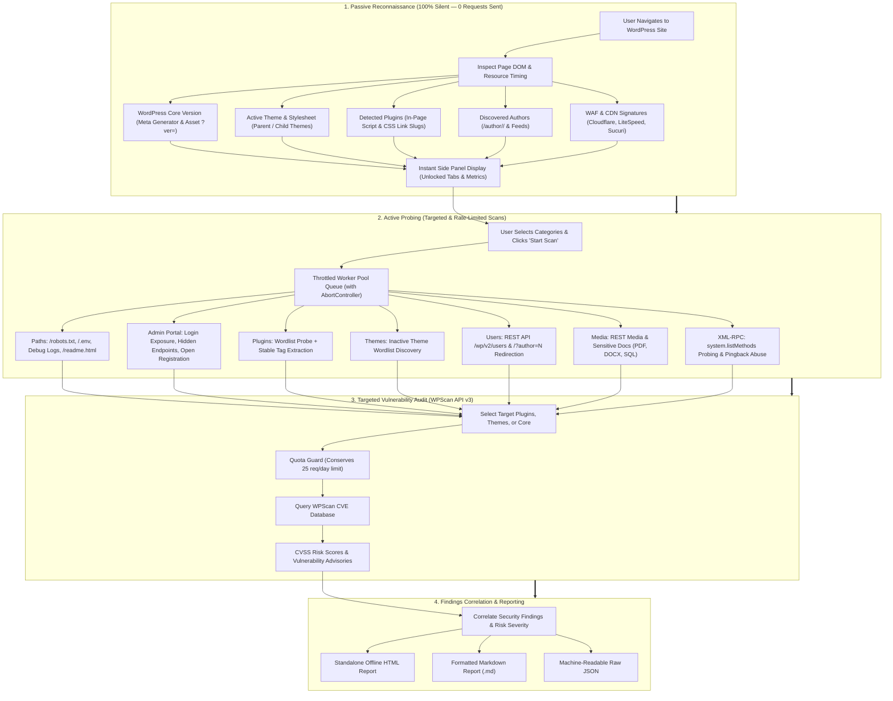
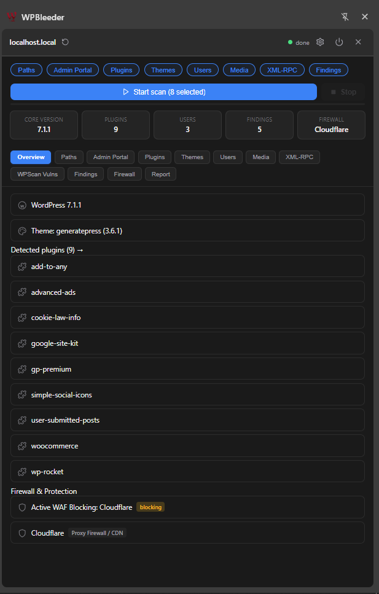

<p align="center">
  
</p>

# WPBleeder

> **Advanced, Client-Side Browser Extension for Stealth WordPress Reconnaissance, Passive Fingerprinting, and Authorized Vulnerability Assessment.**

[](#)
[](#)
[](#)
[](#)
[](#)
[-orange.svg?style=plastic)](#)
[](LICENSE)
[](#)
[](#)

WPBleeder brings full-spectrum WordPress security reconnaissance directly into your browser's native side panel. Operating inside an authentic browser execution environment, it eliminates the runtime overhead of Ruby, Python, Docker, or terminal-based CLI scanners.

> [!TIP]
> **Native WAF & Cloudflare Bypass via Browser Session**: Unlike CLI tools (like WPScan, Nuclei, or ffuf) that get immediately blocked by Cloudflare, LiteSpeed, or Sucuri WAFs, WPBleeder executes probes directly within your **active browser session**. Because all requests automatically share your solved Turnstile/CAPTCHA verification tokens, valid session cookies, authentic TLS fingerprints (JA3/JA4), and native User-Agent, probe traffic is completely indistinguishable from legitimate user browsing.

---

## Reconnaissance & Scanning Workflow

WPBleeder follows a structured 4-stage offensive security pipeline:



---

## Interface Preview

<p align="center">
  
</p>
<p align="center">
  <em>Live Side Panel Interface: Core version, active theme, 9 identified plugins, and real-time Cloudflare WAF detection</em>
</p>

---

## In-Depth Comparison: WPBleeder vs. WPScan (CLI)

Security researchers and penetration testers frequently rely on WPScan CLI. While WPScan has been the industry standard for CLI-based scans, running scans from an external terminal presents severe modern operational limitations against modern web architectures and edge firewalls.

| Feature / Capability | WPScan (CLI) | WPBleeder (Extension) | Advantage |
| :--- | :---: | :---: | :--- |
| **Execution Environment** | External CLI (Ruby / Docker) | Native Browser Side Panel (Vanilla JS) | **WPBleeder**: Zero dependencies, runs anywhere browser runs. |
| **Edge WAF Bypass (Cloudflare, LiteSpeed)** | ❌ Frequently Blocked (403 Forbidden / Challenge) | ✅ **Native Bypass** (Shares authenticated browser session) | **WPBleeder**: Piggybacks on solved Turnstile/CAPTCHA and valid cookies. |
| **Network & TLS Fingerprint** | Synthetic (cURL / Faraday / JA3 mismatch) | **Authentic Browser TLS** (Chrome V8 / Firefox Gecko) | **WPBleeder**: Unflagged by bot heuristics and behavioral analytics. |
| **Initial Footprint** | Aggressive (Sends 100+ requests immediately) | **100% Stealth** (Passive DOM inspect sends 0 requests) | **WPBleeder**: Gathers baseline recon without target seeing a single packet. |
| **API Quota Management** | ⚠️ Consumes full 25 req/day on a single run | ✅ **Granular Target Chips** (Target only specific plugins) | **WPBleeder**: Preserves your free WPScan API daily limit. |
| **Active Scan Control** | Hard kill (`Ctrl+C` leaves TCP hang) | Instant **AbortController** socket termination | **WPBleeder**: Drains queue and halts requests in < 50ms. |
| **Version Spoofing Detection** | Basic regex matching | **Triangulated Verification** (Meta vs Assets vs readme.html) | **WPBleeder**: Identifies fake version strings used to fool scanners. |
| **Inactive Theme Discovery** | Checks active theme only | **Wordlist Probing** against `/themes/*/style.css` | **WPBleeder**: Uncovers forgotten, unpatched themes on disk. |
| **Sensitive Media Flagging** | Not supported | Automatic classification of PDFs, DOCX, archives, SQL dumps | **WPBleeder**: Instant asset audit via REST & sitemaps. |
| **XML-RPC Introspection** | Tests accessibility only | Issues `system.listMethods` payload to list vulnerable functions | **WPBleeder**: Flags `pingback.ping` and `system.multicall` abuse vectors. |
| **Reporting Capabilities** | Plaintext stdout / raw JSON | **Self-Contained Offline HTML**, Markdown, and JSON | **WPBleeder**: Generates client-ready deliverables in one click. |

---

## Comprehensive Feature Matrix

### 1. Core Version Fingerprinting & Anti-Spoofing
- **Multi-Vector Triangulation**: Correlates `<meta name="generator">`, RSS/Atom feeds, scripts/styles query strings (`?ver=X.Y.Z`), and `/readme.html`.
- **Weighted Frequency Filter**: Analyzes `/wp-includes/` core scripts while stripping third-party assets (e.g. jQuery, WooCommerce scripts) to eliminate false version signatures.
- **Spoofing Alert**: Detects and highlights **Version Mismatches** when security plugins have forged the `<meta>` tag to deceive external scanners.

### 2. Plugin Intelligence (Passive + Active)
- **Passive DOM Discovery**: Extracts plugin signatures from script `src`, link `href`, inline comments, and Web Resource Timing without transmitting any network traffic.
- **Active Wordlist Probing**: High-speed, rate-limited probing against a database of popular WordPress plugins.
- **Readme & Header Parsing**: Extracts `Stable tag:` and Changelog version numbers from `readme.txt` endpoints while filtering false-positive HTML 404 redirects.

### 3. Inactive Theme Discovery
- Detects the active theme directly from CSS link references and theme style blocks.
- Probes a curated dictionary of top WordPress themes (`/wp-content/themes/<slug>/style.css`) to reveal **abandoned, inactive themes** that remain vulnerable on the server filesystem.

### 4. Media & Sensitive File Discovery
- Enumerates media library uploads via `/wp-json/wp/v2/media` and XML sitemaps (`/post_tag-sitemap.xml`, `/sitemap_index.xml`).
- Classifies and flags non-image document formats (PDFs, spreadsheets, compressed archives, SQL dumps) that may contain accidental data leaks.

### 5. Sensitive Endpoint & Administrative Probing
- Probes `/robots.txt`, automatically extracting Disallowed directories and custom crawl paths.
- Verifies `/wp-login.php`, `/wp-admin/`, `/wp-cron.php`, debug logs (`/debug.log`), and environment secrets (`/.env`, `/.git/HEAD`).
- Evaluates **User Registration**: Flags whether `/wp-login.php?action=register` is exposed to open account creation.

### 6. User Enumeration
- Multiple enumeration techniques: WordPress REST API (`/wp-json/wp/v2/users`), author archive query probing (`/?author=1..N`), RSS author tags, and sitemaps.
- Generates clickable direct-verification links to test discovered author archives.

### 7. XML-RPC Method Discovery & Exploitability
- Determines whether `/xmlrpc.php` is alive, disabled, or protected.
- Dispatches a real XML payload (`system.listMethods`) to extract all available RPC methods.
- Specifically flags dangerous vectors: `pingback.ping` (DDoS amplification, internal port scanning) and `system.multicall` (brute-force amplification).

### 8. Defensive Intelligence & WAF Heuristics
- **Native Browser Session Bypass**: Probing requests inherit your active browser profile—including authenticated session cookies, solved Cloudflare Turnstile tokens, HTTP/2 multiplexing, and authentic TLS handshakes—seamlessly circumventing bot traps that shut down CLI scanners.
- **Identifies Edge Reverse Proxies & CDNs**: Cloudflare, Sucuri, Imperva, LiteSpeed / QUIC.cloud.
- **Detects Application Security Plugins**: Wordfence, Solid Security (iThemes), NinjaFirewall, All-In-One WP Security.
- **Tactical Recon Advice**: Provides targeted guidance (origin IP discovery via DNS/SSL SANs, safe rate-limiting delays to prevent IP bans, PHP `auto_prepend_file` behavioral alerts).

### 9. Targeted WPScan API v3 Integration
- **Target Selection Chips**: Select exclusively what you wish to audit (e.g., only 1 newly discovered plugin instead of all 6).
- **Quota Guard**: Real-time counter calculates API consumption against the free 25 requests/day allowance before execution.
- **Interactive Terminal & CVE Cards**: View real-time HTTP requests, CVSS severity scores, affected version ranges, and direct links to Wordfence and WPScan advisories.

---

## Installation & Setup

### Google Chrome, Brave, Edge & Chromium
1. Download or clone this repository to your local drive.
2. Open Chrome and navigate to `chrome://extensions`.
3. Enable **Developer mode** (toggle located in the upper-right corner).
4. Click **Load unpacked** and select the [`dist/chrome/`](file:///d:/WPBleader/dist/chrome) folder.
5. Click the **WPBleeder** icon in your browser toolbar to open the Side Panel.

### Mozilla Firefox
1. Download or clone this repository to your local drive.
2. Open Firefox and navigate to `about:debugging#/runtime/this-firefox`.
3. Click **Load Temporary Add-on...**.
4. Select the [`dist/firefox/manifest.json`](file:///d:/WPBleader/dist/firefox/manifest.json) file.
5. Open the sidebar (**View → Sidebar → WPBleeder**) or click the toolbar icon.

---

## Building from Source

WPBleeder is built with zero external runtime dependencies. Native platform build scripts are provided for both Windows and Linux environments without requiring Node.js or npm:

### Windows (PowerShell — No Node.js Required)
```powershell
# Build Chrome distribution
powershell -ExecutionPolicy Bypass -File scripts\build.ps1 -Target chrome

# Build Firefox distribution
powershell -ExecutionPolicy Bypass -File scripts\build.ps1 -Target firefox
```

### Linux / Kali / macOS (Bash & Python 3 — No Node.js Required)
```bash
# Make executable
chmod +x scripts/build.sh

# Build Chrome distribution
./scripts/build.sh chrome

# Build Firefox distribution
./scripts/build.sh firefox
```

### Cross-Platform (Node.js)
```bash
node scripts/build.js chrome
node scripts/build.js firefox
```

Both build scripts produce byte-for-byte SHA256 code parity across all application files.

---

## Repository Structure

```text
WPBleader/
├── assets/
│   ├── banner.png                # High-resolution GitHub repository banner
│   └── preview.png               # Live side panel interface screenshot
├── data/
│   ├── plugin-wordlist.json      # Curated plugin dictionary for active checks
│   └── theme-wordlist.json       # Top 100 theme slugs for inactive theme discovery
├── dist/
│   ├── chrome/                   # Production-ready Chrome MV3 build
│   └── firefox/                  # Production-ready Firefox MV3 build
├── icons/                        # High-resolution extension icons
├── scripts/
│   ├── build.ps1                 # Zero-dependency Windows PowerShell build script
│   ├── build.sh                  # Zero-dependency Linux/macOS Bash build script
│   └── build.js                  # Cross-platform Node.js build script
├── src/
│   ├── background/               # Service Worker & Core Scanning Engines
│   │   ├── index.js              # Message router & active scan orchestrator
│   │   ├── queue.js              # Worker pool queue with AbortController
│   │   ├── waf-detect.js         # Edge WAF & security plugin heuristics
│   │   ├── scan-paths.js         # Endpoint & sensitive path scanner
│   │   ├── scan-admin.js         # Admin portal & registration probing
│   │   ├── scan-plugins.js       # Active plugin wordlist & readme parser
│   │   ├── scan-themes.js        # Inactive theme discovery & style.css parser
│   │   ├── scan-users.js         # REST, feed & author archive user enum
│   │   ├── scan-media.js         # Media REST & document extraction
│   │   ├── scan-xmlrpc.js        # XML-RPC introspection & system.listMethods
│   │   ├── findings.js           # Security issue correlation & scoring
│   │   └── wpscan-api.js         # WPScan API client with quota protection
│   ├── content/
│   │   └── passive-detect.js     # Zero-request DOM & timing detector
│   ├── panel/                    # Extension Side Panel UI (Vanilla ES6)
│   │   ├── panel.html            # Panel markup structure
│   │   ├── panel.css             # Theme styling (dark/light native support)
│   │   ├── panel.js              # UI controller & reactive binding
│   │   ├── state.js              # Reactive state management store
│   │   └── components/
│   │       ├── header.js         # Domain status & execution controls
│   │       ├── chips.js          # Interactive category toggle chips
│   │       ├── tabs.js           # Dynamic tab switcher & target selectors
│   │       ├── row.js            # Reusable UI row components
│   │       ├── settings-drawer.js# Settings drawer (concurrency, delays, API keys)
│   │       └── report-export.js  # Standalone HTML, Markdown & JSON exporter
│   ├── options/                  # Extension preferences page
│   ├── platform/                 # Cross-browser runtime abstractions
│   ├── lib/                      # Storage & session persistence utilities
│   └── manifest/                 # Modular manifest sources (common, chrome, firefox)
├── DISCLAIMER.md                 # Security research terms & legal liability disclaimer
├── LICENSE                       # MIT License
└── README.md                     # Project documentation
```

---

## Legal & Compliance Notice

> [!CAUTION]
> **Authorized Security Testing Only**: WPBleeder is developed exclusively for authorized penetration testing, professional security audits, and vulnerability assessments on systems where you possess explicit, written permission from the system owner.
>
> Executing active security scans against targets without prior authorization violates computer crime laws, including the **United States Computer Fraud and Abuse Act (CFAA - 18 U.S.C. § 1030)**, the **United Kingdom Computer Misuse Act 1990**, and **Directive 2013/40/EU**.
>
> The author assumes **zero liability** for any downtime, data loss, server interruption, or legal consequences arising from the use or misuse of this software. For complete terms, see [DISCLAIMER.md](DISCLAIMER.md).

---

## License

This project is licensed under the [MIT License](LICENSE).
Copyright (c) 2026 R1F43 (R1F43@proton.me).

